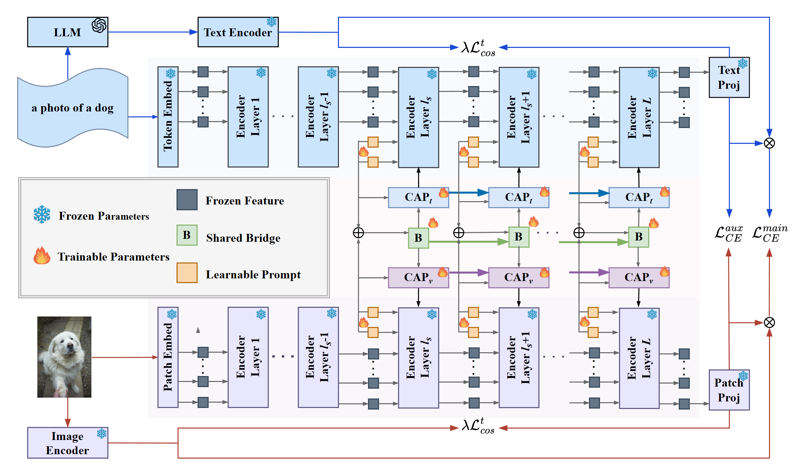

# CHAS: Conditional Attention Priors with Shared Representation Bridge for Hierarchical Vision-Language Adaptation

This is the official implementation of the paper **"CHAS: Conditional Attention Priors with Shared Representation Bridge for Hierarchical Vision-Language Adaptation"**.

## Abstract

Large vision-language models (VLMs) have shown strong zero-shot recognition ability by learning aligned image-text representations from large-scale pre-training. However, adapting these VLMs to few-shot downstream tasks remains challenging, as existing prompt tuning paradigms suffer from delayed cross-modal interaction, unconstrained attention mixing, and degradation of the pretrained semantic space.

To address these limitations, we propose **CHAS** (Conditional Attention Priors with Shared Representation Bridge for Hierarchical Vision-Language Adaptation), a parameter-efficient architecture that decomposes the multimodal adaptation process into cross-modal bridging, conditional guidance, and semantic anchoring.

## Framework



## 🔧 Installation

Our environment builds upon CoOp and MaPLe. Follow the step-by-step instructions below to create and configure your conda environment.

### 1. Setup Conda Environment (Recommended)

```bash
# Create a conda environment with Python 3.10+ (required for latest PyTorch)
conda create -y -n chas python=3.10

# Activate the environment
conda activate chas

# Install PyTorch and related libraries
pip install torch==2.4.0 torchvision==0.19.0 torchaudio==2.4.0 --index-url https://download.pytorch.org/whl/cu121

git clone https://github.com/YourUsername/CHAS.git
cd CHAS/

```

### 2. Install Dassl Library

 The official Dassl.pytorch repository (https://github.com/KaiyangZhou/Dassl.pytorch.git) is currently inaccessible from mainland China. You can use a mirror site or download the source code archive manually.

```bash
# Clone the repository (if accessible)
git clone https://github.com/KaiyangZhou/Dassl.pytorch.git
cd Dassl.pytorch/

# Install dependencies
pip install -r requirements.txt

# Install in development mode
python setup.py develop

```

## 📂 Data Preparation

Prepare datasets following the standard CoOp dataset setup. Update the dataset root path in the shell scripts under `scripts/chas/`:

```bash
# Edit the DATA variable in the scripts
DATA="/path/to/your/dataset/folder"
```

## 🚀 Running CHAS

### Base-to-Novel Generalization

```bash
# Training
CUDA_VISIBLE_DEVICES=0 bash scripts/chas/base2new_train.sh imagenet 1

# Evaluation
CUDA_VISIBLE_DEVICES=0 bash scripts/chas/base2new_test.sh imagenet 1
```

### Few-Shot Learning

```bash
# Example: 16-shot training on Oxford Pets
CUDA_VISIBLE_DEVICES=0 bash scripts/chas/few_shot.sh oxford_pets 16
```

### Cross-Dataset Transfer

```bash
# 1. Mandatory base training on ImageNet (run this first)
CUDA_VISIBLE_DEVICES=0 bash scripts/chas/cross_train.sh imagenet 1

# 2. Evaluate on target dataset (replace caltech101 with your dataset name)
CUDA_VISIBLE_DEVICES=0 bash scripts/chas/crsoo_test.sh caltech101 1
```

## 📚 Acknowledgements

We sincerely appreciate the contributions of the following projects:
- [CoOp](https://github.com/KaiyangZhou/CoOp)
- [MMRL](https://github.com/yunncheng/MMRL)
- [HiCroPL](https://github.com/hicropl/hicropl)

Our codebase is built upon their work.
